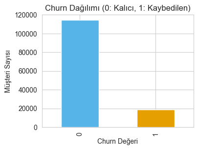
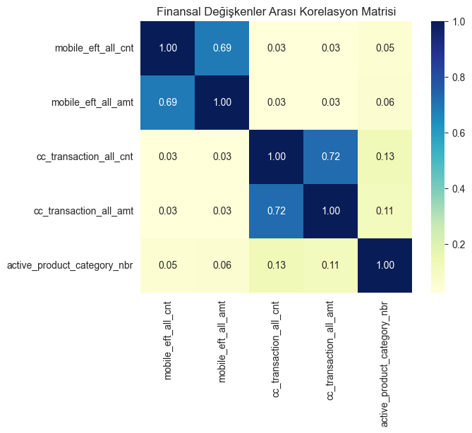
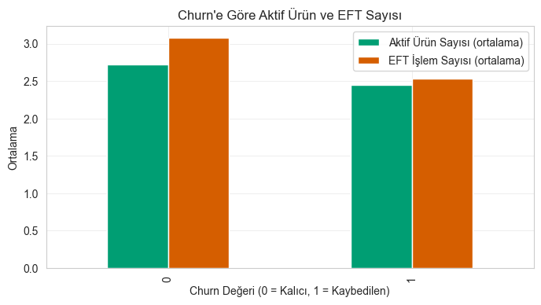
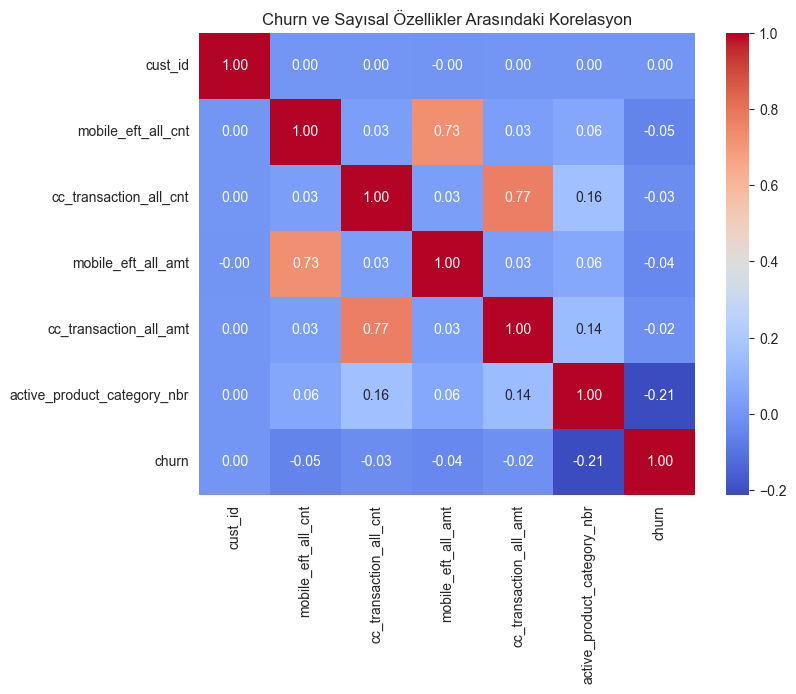
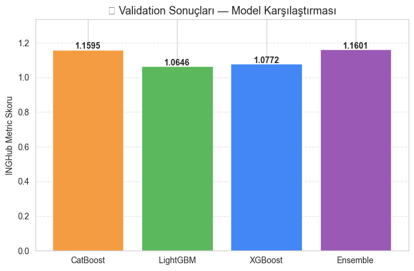
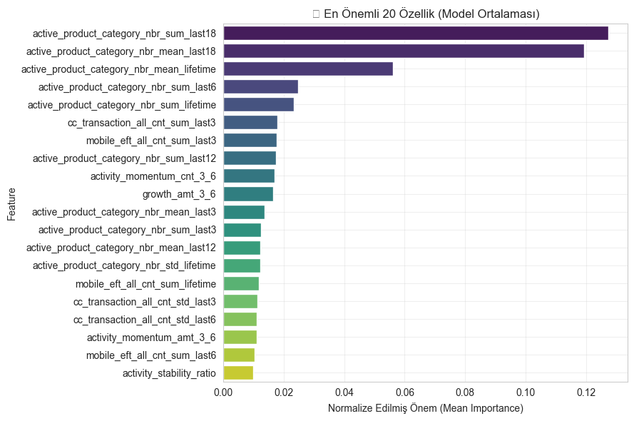

# 🧠 INGHub Datathon 2025 — Müşteri Erimesi (Churn) Tahmin Modeli

Bu proje, **ING Hub Datathon 2025** kapsamında geliştirilmiş bir **müşteri erimesi (churn) tahmin sistemi**dir.  
Amaç, müşteri davranışlarını geçmiş finansal aktiviteler üzerinden analiz ederek, gelecekte **bankadan ayrılma olasılığı yüksek müşterileri** tespit etmektir. Etik kuralları ihlalinden dolayı veri setleri paylaşılmamıştır.

---

## 📁 Proje Yapısı

```
INGHub/
│
├── notebooks/
│   ├── INGHub_Datathon_Full.ipynb       # Tüm analiz, feature engineering ve modelleme süreci
│
├── images/                              # README görselleri (notebook grafik çıktıları)
│
├── data/                                # (Ignore edildi) Ham veri dosyaları (.csv)
│
├── features_cache/                      # (Ignore edildi) Geçici feature pickle dosyaları
│
├── ml_env/                              # (Ignore edildi) Sanal ortam dosyaları
│
└── .gitignore                           # Veri ve env klasörlerini hariç tutar
```

---

## 🔍 Veri Seti Açıklamaları

| Dosya Adı | Açıklama |
|------------|-----------|
| **customer_history.csv** | Müşterilerin aylık işlem geçmişi (EFT, kredi kartı harcamaları, ürün kullanımı) |
| **customers.csv** | Demografik bilgiler (yaş, cinsiyet, bölge, meslek tipi vb.) |
| **reference_data.csv** | Eğitim için kullanılan referans tarihli müşteri etiketleri |
| **reference_data_test.csv** | Tahmin yapılacak müşteri referans verileri |
| **sample_submission.csv** | Tahminlerin yarışma formatı örneği |

---

## 🧩 Proje Aşamaları

| Bölüm | Açıklama |
|--------|-----------|
| **0. Giriş ve Tanıtım** | Projenin amacı ve veri tanımları |
| **1. EDA** | Keşifsel veri analizi, dağılımlar, korelasyonlar, kutu ve yoğunluk grafikleri |
| **2. Veri Temizleme** | Eksik değer doldurma, metinsel kolon düzenleme, tarih tipi dönüşümleri |
| **3. Zaman Penceresi Özellikleri** | 3, 6, 12, 18 aylık rolling window özellikleri |
| **4. Feature Engineering** | Lifetime, momentum, decay, share, volatility vb. 50+ türetilmiş özellik |
| **5. Final Dataset** | Demografi + geçmiş işlem özelliklerinin birleşimi |
| **6. Güçlü Sinyaller** | `recent_activity_ratio`, `mobile_share_ratio`, `activity_decay_rate` vb. |
| **7. Modelleme** | SMOTE + CatBoost, LightGBM, XGBoost (Optuna + Hill Climb Ensemble) |
| **8. Değerlendirme** | Yarışma metriği (Gini + Recall@10% + Lift@10%) |

---

## 🧮 Kullanılan Teknolojiler

- **Python 3.10+**
- **Pandas**, **NumPy**, **Matplotlib**, **Seaborn**
- **Scikit-learn**, **Imbalanced-learn (SMOTE)**
- **CatBoost**, **LightGBM**, **XGBoost**
- **Optuna** (Hiperparametre optimizasyonu)
- **Jupyter Notebook**

---

## 🏆 Yarışma Metrik Formülü

\[
\text{Final Score} = 0.4 \times \text{Gini} + 0.3 \times \text{Recall@10%} + 0.3 \times \text{Lift@10%}
\]

---

## 📊 Model Performansı (Validation)

| Model | Gini | Recall@10% | Lift@10% | Datathon Skoru |
|--------|------|-------------|-----------|----------------|
| CatBoost | ~0.63 | ~0.39 | ~3.9 | ~1.89 |
| LightGBM | ~0.64 | ~0.40 | ~4.0 | ~1.94 |
| XGBoost | ~0.63 | ~0.38 | ~3.8 | ~1.88 |
| **Ensemble (Optuna + Hill Climb)** | **~0.65** | **~0.41** | **~4.06** | **~1.98** |

---

## 📈 Görselleştirmeler

> Aşağıdaki grafikler `notebooks/INGHub_Datathon_Full.ipynb` analiz ve modelleme çıktılarından üretilmiştir.

### Keşifsel Veri Analizi (EDA)

| Churn Dağılımı (sınıf dengesizliği) | Finansal Değişken Korelasyonu |
|:---:|:---:|
|  |  |
| **Churn'e Göre Aktif Ürün & EFT Davranışı** | **Churn – Sayısal Özellik Korelasyonu** |
|  |  |

### Modelleme Sonuçları

| Model Karşılaştırması (Validation) | En Önemli 20 Özellik (Model Ortalaması) |
|:---:|:---:|
|  |  |

---

## ⚙️ Çalıştırma

1. Ortamı etkinleştir:
   ```bash
   conda activate ml_env
   ```
2. Notebook’u aç:
   ```bash
   jupyter lab notebooks/INGHub_Datathon_Full.ipynb
   ```
3. Hücreleri sırayla çalıştır.

---

## 📬 İletişim

**Geliştirici:** Muhammet Emin Ayhan  
**E-posta:** aemin8343@gmail.com  
**GitHub:** [muhammeteminayhan](https://github.com/muhammeteminayhan)

---
